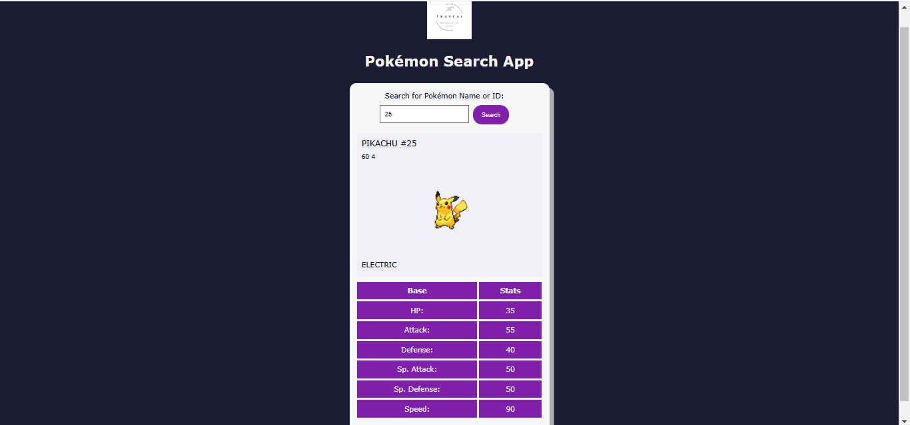

# Pokemon Search

In this project, you'll build an app that will search for Pokémon by name or ID and display the results to the user. To retrieve the Pokémon data and images, you'll use freeCodeCamp's PokéAPI Proxy.

# [live](https://sabovoichita.github.io/pokemon-search/)

